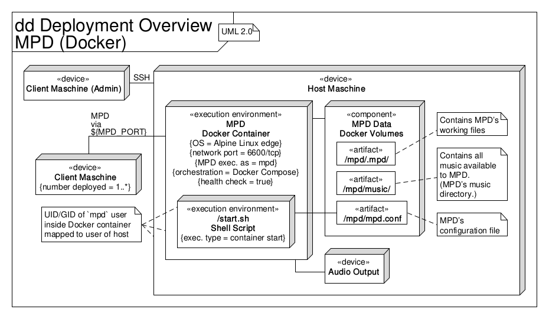

# MPD (Docker)

A home audio, local playback MPD Docker image with UID/GID handling, based on
Alpine Linux.

*The [Quickstart section](#quickstart) shows the fastest way to set everything
up without providing further details.*

This MPD Docker image setup plays back audio files locally, streaming audio
directly to the Docker host machines’ sound card.  
This Docker image is not designed for network streaming.  
Clients (usually users within the same LAN as the Docker host machine) can
interact with MPD using one of the many MPD software clients available.
Within the Docker container the MPD server is executed by an `mpd` user, whos
UID/GID is specified at container start.  
The UML deployment diagram in the figure below gives an overview.



> Used terminology in this documentation:
> * Client - Client machine that connects to the host
> * Host - Host machine that runs the Docker container

> Used variables in this documentation:
> * `MPD_BASE_PATH` - Path to the directory that contains this project’s files
>   (especially `Dockerfile` + other build-related files and
>   `docker-compose.yml`)
> * `MPD_GID` - GID assigned to the `mpd` user within the Docker container,
>   e.g. `1000`.
>   The access permissions of the content created in the Docker volumes will be
>   set to this GID.
> * `MPD_PORT` - Network port used for the MPD connection (to control the MPD
>   music server), e.g. `6600`
> * `MPD_UID` - UID assigned to the `mpd` user within the Docker container,
>   e.g. `1000`.
>   The access permissions of the content created in the Docker volumes will be
>   set to this UID.
> * `MPD_MUSIC_DIR_SUBPATH` - A path relative to MPD’s music directory
> * `MUSIC_DIR` - An audio file directory name on the host
> * `VERSION` - Version of this project, e.g. `1.0.0`.
>   Adheres to [Semantic Versioning](https://semver.org).

## Quickstart

**How to** set everything up the fastest way possible:

Step 1:

```sh
$ cd ${MPD_BASE_PATH}
$ make build
$ make prepare-deploy
```

... and adjust `docker-compose.yml` and `mpd/mpd.conf`.

Step 2:

```sh
$ make deploy
$ make database-update
```

... and wait for the MPD database update to finish.

> Use `make show-status` to query MPD’s database update status.

## Applicability

The main use case for this project is to provide an MPD music server that plays
audio files locally on the home audio loudspeakers, streaming audio only to the
host’s sound card.
Clients connected to MPD over a network (usually LAN) can control the local
playback of audio files.

*This project is not intended for streaming audio files over a network.*

## Requirements

For basic usage (mandatory):
* Docker

For easy handling (recommended):
* Docker Compose
* Make

## Makefile

Most of the instructions in this documentation can also be run with the
provided `Makefile` (which uses Docker Compose).
Run `cd ${MPD_BASE_PATH} && make help` to see the list of available targets.

> The Makefile uses Docker Compose, see the prerequisite in "How to run the
> container with Docker Compose" in the [Run section](#run).

## Build

**How to** build the Docker image:

```sh
$ cd ${MPD_BASE_PATH}
$ sudo docker build -t mpd:${VERSION} .
$ sudo docker image tag mpd:${VERSION} mpd:latest
```

## Arguments

* Exposed port: `6600`
* Volumes:
    * `/mpd/mpd.conf`: Volume that only holds MPD’s configuration file
    * `/mpd/.mpd/`: Volume to store MPD’s work files
    * `/mpd/music/`: Volume that maps locally stored audio files into MPD’s
      music directory
* Devices:
    * `/dev/snd/`: Device (audio sink) to which MPD streams audio
* Environment variables:
    * `PUID`: UID that is assigned to the `mpd` user inside the Docker container
    * `PGID`: GID that is assigned to the `mpd` user inside the Docker container

> Symlinks do not work with Docker.  To map (i.e., link) multiple audio file
> locations into MPD’s music directory (`/mpd/music/`) create each as a
> seperate Docker volume (mounted in its own directory under `/mpd/music/`),
> e.g., `[...]/${MUSIC_DIR}:/mpd/music/${MUSIC_DIR}/`.

## Run

Prerequisite:
Copy `mpd.conf.template` to `mpd/mpd.conf` and adjust it.

> The MPD configuration file only contains the bare minimum of settings
> necessary to run MPD.
> You can change these settings and add new ones but mind the non-modifiable
> settings at the end of this file.
> For available options see
> [MPD User’s Manual](https://www.musicpd.org/doc/html/user.html#configuration)
> and the vanilla `/etc/mpd.conf` file inside the Docker container.
> The latter can be retrieved with
> `sudo docker run --rm mpd:latest cat /etc/mpd.conf > ${MPD_BASE_PATH}/mpd/mpd.conf.template-vanilla`.

**How to** run the Docker container:

```sh
$ cd ${MPD_BASE_PATH}
$ mkdir -p ./mpd/mpd/playlists/ ./mpd/music/
$ sudo docker run \
  -d \
  -p ${MPD_PORT}:6600 \
  -v ${MPD_BASE_PATH}/mpd/mpd.conf:/mpd/mpd.conf:ro \
  -v ${MPD_BASE_PATH}/mpd/mpd/:/mpd/.mpd/ \
  -v ${MPD_BASE_PATH}/mpd/music/:/mpd/music/:ro \
  --device /dev/snd/:/dev/snd/ \
  -e PUID=${MPD_UID} \
  -e PGID=${MPD_GID} \
  --cap-add SYS_NICE \
  --name="mpd" \
  mpd:latest
```

**How to** run the container with Docker Compose:

Prerequisite:
Copy `docker-compose.yml.template` to `docker-compose.yml` and adjust it.

> Instead of modifying `docker-compose.yml` after copying it, one can create an
> `.env` file that provides the necessary variables:
>
> ```sh
> MPD_PORT=
> MPD_BASE_PATH=
> MPD_UID=
> MPD_GID=
> ```
>
> This works only as long as there is only one audio file location on the host.
> ALso see the [Arguments section](#arguments) for more details.

```sh
$ cd ${MPD_BASE_PATH}
$ mkdir -p ./mpd/mpd/playlists/ ./mpd/music/
$ sudo docker-compose up -d
```

## Basic usage

To use all of of mpc’s functionality, enter the Docker container interactively
and run `mpc` there:

```sh
$ sudo docker exec -it -u mpd mpd ash
$ mpc [...]
```

> Or with Docker Compose:
> `sudo docker-compose exec -u mpd mpd ash`

> All "how to"s below can also be run interactively this way.
> In particular, this has the advantage of autocompletion of paths within MPD’s
> music directory for, e.g., adding music or partially updating MPD’s database.

**How to** update MPD’s database:

> This functionality is usually also provided on the client.

```sh
$ sudo docker exec -u mpd mpd mpc update
```

> Or with Docker Compose:
> `sudo docker-compose exec -u mpd mpd mpc update`

> To debug or (after the initial MPD database update) to update only a certain
> path within MPD’s music directory see "How to partially update MPD’s
> database" in the [Troubleshooting section](#troubleschooting)).

**How to** querry MPD’s status:

```sh
$ sudo docker exec -u mpd mpd mpc status
```

> Or with Docker Compose:
> `sudo docker-compose exec -u mpd mpd mpc status`

## Troubleshooting

**How to** show MPD’s log (STDOUT/STDERR messages):

```sh
$ sudo docker logs -t -f mpd
```

**How to** partially update MPD’s database:

> This can be useful to debug MPD database update issues, e.g., locating an
> offending audio file with corrupted ID3 tags that causes the update to fail.
> Also see "How to show MPD’s log (STDOUT/STDERR messages)".

```sh
$ sudo docker exec -u mpd mpd mpc update ${MPD_MUSIC_DIR_SUBPATH}
```

> Or with Docker Compose:
> `sudo docker-compose exec -u mpd mpd mpc update ${MPD_MUSIC_DIR_SUBPATH}`
